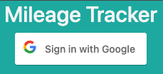
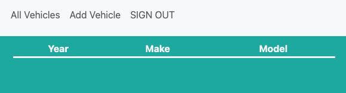
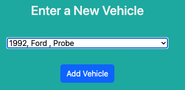
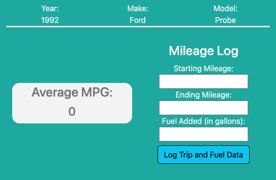
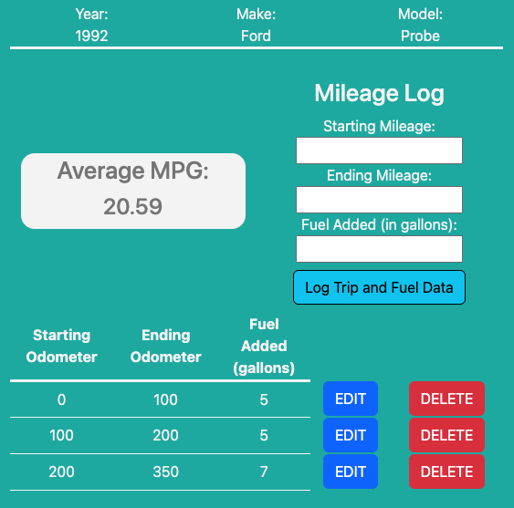
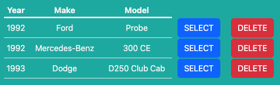

# [Mileage Tracker](https://shy-pink-dhole-wig.cyclic.app)

Mileage tracker is a simple yet effective full stack web application usable in modern browsers and was created using MongoDB, Mongoose, Express.js, Node.js, and OAuth 2.0 for functionality and bootstrap for portions of element styling.

## Concept

Mileage Tracker provides a clean and simple interface for users who wish to manually track fuel economy for any vehicle they choose.  Upon logging in, users may select a vehicle from a collection, and then input trip data including:

- Starting odometer reading
- Ending odometer reading
- Fuel pumped into the vehicle (in gallons)

Using this information, the application performs its primary task of calculating a running average miles per gallon calculation.

Further, users are able to remove a vehicle from their personal collection as well as modify mileage and fuel information per vehicle at any time.

>__Note__: Users must be logged in to use all features of the application.

## Instructions

The user logs in:

Upon first logging in, the user must __create__ a vehicle:

After clicking "Add Vehicle" from the nav bar, the user is prompted to select a vehicle from the drop down:

>__Note__: The list of vehicles is far from exhaustive.  This is a known deficiency and ice box item.

Upon selecting a vehicle, the user is redirected to the primary view for their created vehicle so they may begin tracking mileage and fuel data

After at least one start odometer entry, end odometer entry, and fuel log, they system will have enough information to begin providing MPG calculations for the vehicle.  Users may __update__ or __delete__ trip information entries.

>__Note__: The user may include as much or as little data as they choose.  The calculation is only as accurate as the data provided to the application.

At this stage, users may add as many vehicles as they choose for MPG calculations.

## Icebox Items

1. Tap into an exhaustive list of automobile assets for user selection

2. Granular MPG calculations such as per fill up and by specified date ranges

3. To input fuel costs so I can see average fuel cost per mile in addition to vehicle MPG

4. Enter the VIN (or scan the VIN barcode on the door) of a vehicle and have all of the vehicle data populate automatically

## Credits

"Sign in with Google button" button provided by [Mirko Akov](https://codepen.io/mupkoo/pen/YgddgB)